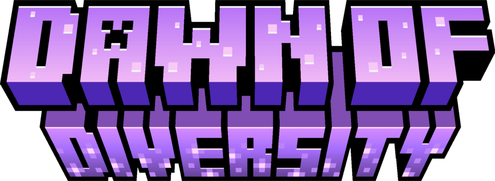

 
 
Dawn of Diversity (dod) is a datapack for Minecraft Java Edition that adds different species, each player chooses a species when they join the game. Each species has a different set of abilities, if you want to change your species, you can find out how to do that <a href="https://github.com/chimkingOverlord/Dawn-Of-Diversity/wiki/Changing-Species">here</a>
